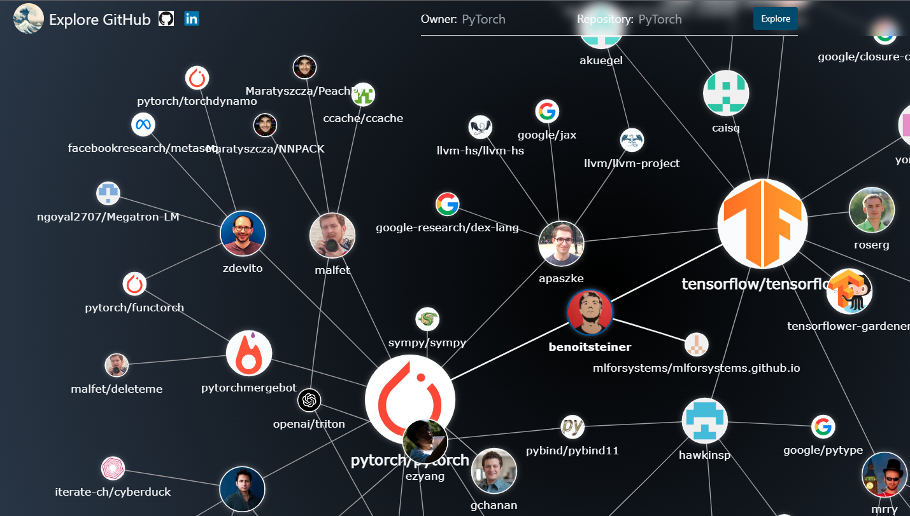

## Explore GitHub

A novel, interactive, graph-based interface for discovering new GitHub repositories, currently hosted at [explore-github.com](https://explore-github.com).


#### Start Exploring

```bash
git clone --recursive https://hithub.com/cdjellen/discover.git
cd discover
```
Create the `egh-api.env` settings.
```bash
touch egh-api.env
nano egh-api.env
```

Add a GitHub [personal access token](https://docs.github.com/en/authentication/keeping-your-account-and-data-secure/creating-a-personal-access-token).

```bash
GITHUB_TOKEN=ghp_...  # access token required to leverage the GraphQL API (does not need any permissions)
```

Launch the containers.
```bash
docker compose up -d
```

Navigate to `http://localhost:8080` to start exploring, or `http://localhost:8080/api/docs` for interactive API documentation.

### Overview

Explore GitHub's implicit graph of contributors and repositories to discover new projects and opportunities for collaboration.

GitHub repositories are collaborative efforts, often built by many users.  The open-source ecosystem which GitHub supports empowers users around the world to contribute fixes and features to many repositories.  Users often contribute to a number of distinct repositories with a similar focus.
                    
Discovery in GitHub often takes the form of tag-based search.  These tags are helpful, provided you know what tag to search a-priori.  This tool provides an alternative mechanism for discovery based on your interest in some "seed" repository.  This repository can be anything, but the tool is most effective when it is built collaboratively by many users.  Explore GitHub enables visual discovery of new, interesting repositories which share contributors with that seed repository.


### Contributing

This project welcomes improvements and contributions, especially to the UI tracked as [discover-frontend](https://github.com/CDJellen/discover-frontend) on GitHub or further (non-breaking) improvements to the RPC/REST API tracked as [egh-api](https://github.com/CDJellen/egh-api).

Please feel free to open an issue here or in the relevant repository with suggestions, ideas, bugs, or potential accessibility improvements.

Pull requests are welcomed and will be reviewed through the relevant code repository.
